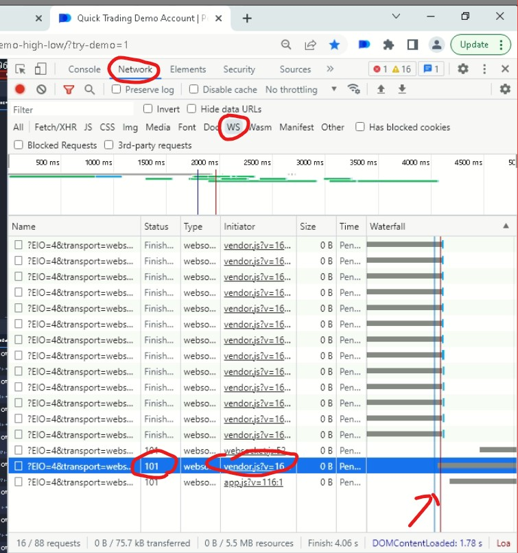
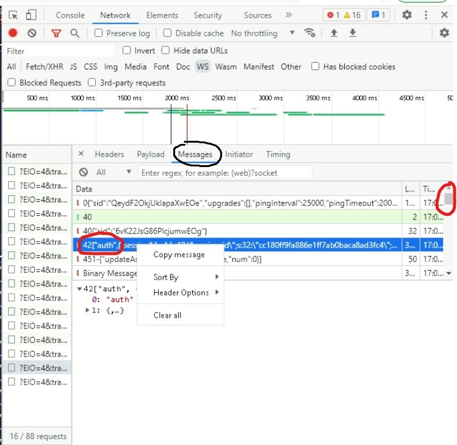
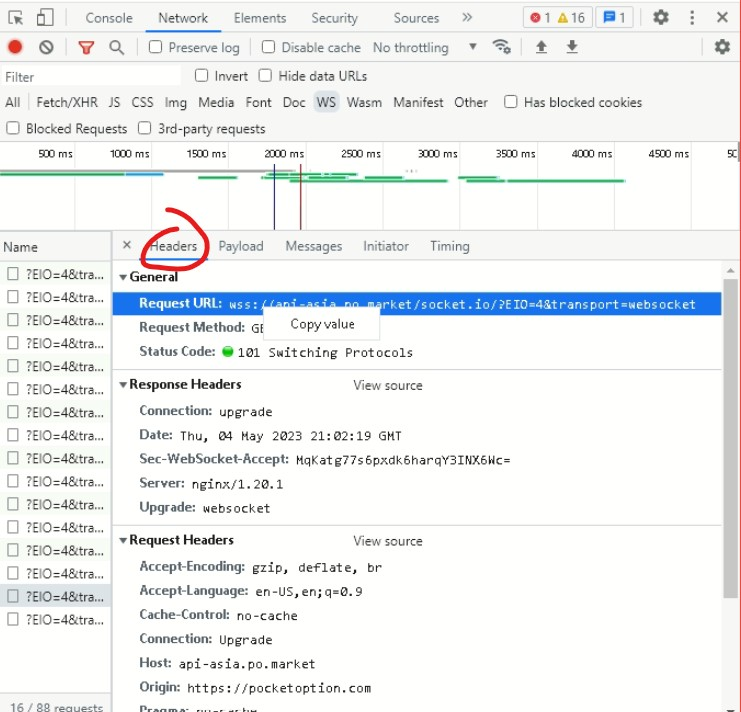
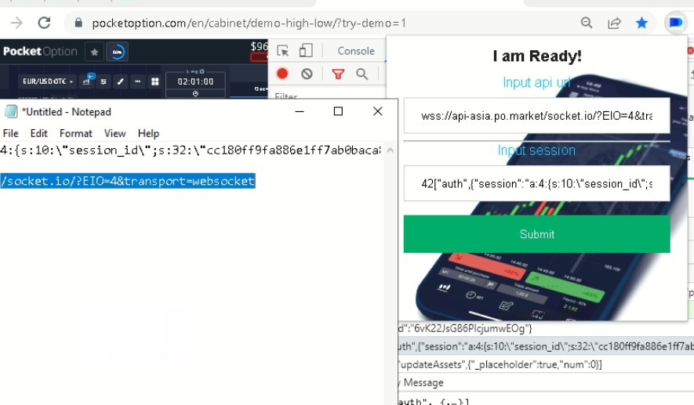

#  Pocket_option

Pocket Option Monitor

## Features

- Get Incoming Socket Message
- Send it Special Endpoint

## Install

[**Chrome** extension]()

## Dev Mod
- npm run watch
- npm run build

## Contribution

Suggestions and pull requests are welcomed!.

---

## How To Use It
- Go to Inspect Network Panel -> Press (CTRL+R)
- Find the pending socket and Get url and session message
- Enter those using NotePad Or Sticky Note
- You can check how it work on console
---
### Find target WebSocket
# 
### Find Session ID
# 
### Find URL
# 
### Input
# 

This project was bootstrapped with [Chrome Extension CLI](https://github.com/dutiyesh/chrome-extension-cli)

